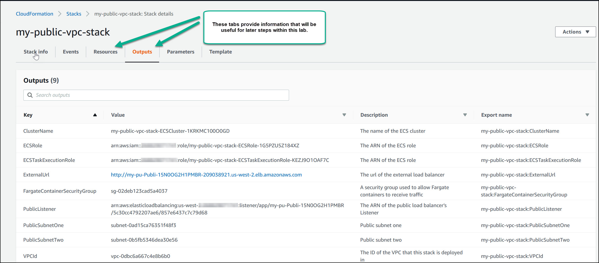

# Container Services using .NET Core, Cross-Platform Tools, and AWS Fargate
Amazon Web Service (AWS) Fargate is a compute cluster engine that automatically manages containerized application deployment configurations.  There is no need to provision, manage, or scale any underlying Amazon EC2 compute infrastructure.

Fargate works with Amazon Elastic Container Service (ECS) and can run microservices developed in many programming languages or application frameworks including Java, .NET Core, Python, Node.js, Go, or Ruby on Rails. 

There are numerous methods available to develop, build, and deploy .NET Core solutions and to leverage container hosting services such as ECS, Fargate, and EKS. 

The most accessible approach is to utilize the [AWS Toolkit for Visual Studio](https://docs.aws.amazon.com/toolkit-for-visual-studio/latest/user-guide/deployment-ecs-aspnetcore-fargate.html) which provides nicely integrated project templates and publishing wizards. 
An extension for [Visual Studio Code](https://github.com/aws/aws-toolkit-vscode) also offers a nice cross-platform tooling experience.

Command-line tooling options include the [AWS CLI](https://docs.aws.amazon.com/AmazonECS/latest/developerguide/ECS_AWSCLI.html), the [AWS ECS CLI](https://docs.aws.amazon.com/AmazonECS/latest/developerguide/ECS_CLI.html), 
or the [AWS .NET Core Global Tools](https://aws.amazon.com/blogs/developer/net-core-global-tools-for-aws/).  And, even combinations of these script libraries.

A tool comparison matrix is beyond the scope of this article. Instead, this article is intended for the command-line afficionados who may need to gain experience leading towards script-based automation of their build-to-publish pipeline. 
All of the steps taken herein would be automated in a real-world DevOps environment.

Herein, we illustrate building, deploying, and running a .NET Core containerized solution using cross-platform command line tools.

* Estimated Completion Time : 60 minutes
* Requirements : A laptop or workstation (Windows, Mac, Linux) with a Terminal application. Refer to  <a href="#appendix-a">**Appendix A**</a> herein.
* An [AWS Account](https://aws.amazon.com/account/)

**Credits** 

This lab is derived from work done by others including:
* https://github.com/aws-samples/amazon-ecs-fargate-aspnetcore/
* https://aws.amazon.com/blogs/compute/hosting-asp-net-core-applications-in-amazon-ecs-using-aws-fargate/
* https://github.com/nathanpeck/awesome-ecs


### Reference Architecture

A reference architecture for an AWS Fargate deployment should specify artifacts such as a VPC, Subnets, Load Balancer, Internet Gateway, Elastic Network Interface (ENI), AWS Fargate Task, Network ACLs, and Security Groups. The architectural choices for VPC Networking, Load Balancing, and Container Networking will vary based upon solution requirements.

Herein, our example ASP.NET Core application will serve traffic from the Internet.  Hence, we will deploy containers in a public VPC Subnet using a Public Load Balancer option.

Refer to this [AWS Labs github project](https://github.com/awslabs/aws-cloudformation-templates/tree/master/aws/services/ECS) for solution architecture options and illustrations.

Figure 1 illustrates a corresponding reference architecture. 


**Figure 1 – Reference Architecture**

To implement this architecture, we will do the following:

* Containerize the ASP.NET core application.
* Configure the reverse-proxy server.
* Containerize the Nginx reverse-proxy server.
* Create the Docker Compose file.
* Push container images to Amazon ECR.
* Create the ECS cluster.
* Create an Application Load Balancer.
* Create an AWS Fargate Task definition.
* Create the Amazon ECS service.

<a id='dev-env'></a>
### Development environment
Your development environment needs to have the following minimal tools configuration.

**A Dev-Environment with the following development tools and services.** 
1. .NET Core  (https://dotnet.microsoft.com/download/dotnet-core)
2. AWS Command Line Tools (aws)  (https://aws.amazon.com/cli/)
3. AWS .NET Core Global Tools for ECS (dotnet-ecs)  (https://github.com/aws/aws-extensions-for-dotnet-cli)
4. Docker Tools and Services (docker) (https://www.docker.com/)
5. Docker Compose (docker-compose)  (https://docs.docker.com/compose/overview/)
6. Nginx (https://aws.amazon.com/amazon-linux-2/faqs/#Amazon_Linux_Extras)


**Your Lab Workstation - A Remote AWS Linux AMI Instance**
1. For this lab, we utilize an EC2 hosted **.NET Core 2.1 with Amazon Linux 2 - Version 1.0** instance.  This Amazon Machine Image (AMI) is preconfigured with both **AWS CLI** and the **dotnet** runtime.  It doesn't include **AWS .NET Core Global Tools** nor **docker**, but we will install those.
2. Don't know how to create an EC2 instance?  Please refer to step-wise documentation at (https://aws.amazon.com/getting-started/tutorials/launch-a-virtual-machine/). 
3. When creating your AMI instance, be sure to select the **.NET Core 2.1 with Amazon Linux 2 - Version 1.0** AMI-type.  We recommend utilizing a **t2.large** or better host-machine type. 
4. When creating your EC2 instance, be sure to either download (or select an existing) **PEM** key file for subsequent use for secure shell (SSH) logon from your local terminal application.
5. Refer to  <a href="#appendix-a">**Appendix A**</a> herein for instructions on accessing your AMI instance via SSH. 

**Proceed with installation of the following tools only after completion of the above workstation guidance.  All further lab instructions are to be executed from a terminal window remoting into your EC2 instance via SSH.**

**Update and configure your Lab Workstation**

1. Using your local Terminal application, login to the remote Lab Workstation.
``` shell
ssh -i MYKEYPAIR.pem ec2-user@myEc2IpAddress

login examples:
ssh -i ~\downloads\mykeypair.pem ec2-user@ec2-34-219-242-224.us-west-2.compute.amazonaws.com
ssh -i %HOME%\Downloads\mykeypair.pem ec2-user@ec2-34-219-242-224.us-west-2.compute.amazonaws.com
```
2. Update the current image package configuration.
``` shell
sudo yum update -y
```
3. Install the AWS .NET Core Global Tools for ECS.
``` shell
dotnet tool install -g Amazon.ECS.Tools
```
4. Install Docker Tools and Services.
``` shell
sudo yum install -y docker
sudo service docker start
```
5. Add the **ec2-user** account to the **docker group** to enable use without root privileges (i.e. sudo).
``` shell
sudo usermod -a -G docker ec2-user
```
6. Install the Nginx service supporting our Reverse Proxy configuration.
``` shell
sudo amazon-linux-extras install nginx1.12
``` 
7. Install Docker Compose for testing our containers via localhost. Ensure that `docker-compose` has the execute attribute enabled.
``` shell
sudo curl -L "https://github.com/docker/compose/releases/download/1.24.0/docker-compose-$(uname -s)-$(uname -m)" -o /usr/local/bin/docker-compose
sudo chmod +x /usr/local/bin/docker-compose
```
8. Logout and login again in order to effect the `ec2-user` user group privilege change made previously.
``` shell
logout
```
``` shell
login examples:
ssh -i ~\downloads\mykeypair.pem ec2-user@ec2-34-219-242-224.us-west-2.compute.amazonaws.com
ssh -i %HOME%\Downloads\mykeypair.pem ec2-user@ec2-34-219-242-224.us-west-2.compute.amazonaws.com
```
9. Test these installed packages.
``` shell
aws --version
```
``` shell
dotnet --version
```
``` shell
dotnet-ecs --version
```
``` shell
docker --version
docker ps
```
``` shell
docker-compose --version
```

### Create an ASP.NET Core MVC application
Let's leverage the `dotnet` Global Tools project templates for creating, building and publishing an ASP.NET Core MVC application. 

From your SSH terminal session, invoke the following command sequence.

``` shell
cd ~/    

mkdir myproject     

mkdir myproject/mywebapp

cd myproject/mywebapp

dotnet new -all  (note: You should see a listing of available .NET project templates.  We will utilize the ASP.NET Core Web App MVC template.)

dotnet new mvc

dotnet restore

dotnet build 

dotnet publish -c "release"
```

The above command set creates an ASP.NET Core MVC web application, restores dependencies, builds the application, and publishes the application package to the release folder.


### Containerize your ASP.NET Core application
create a file named `Dockerfile` within the root `mywebapp` folder and copy the following `docker` build script and create a file named `Dockerfile` within the root `mywebapp` folder.  (If using a Linux workstation for your development environment, consider using the `nano` text editor.)

``` shell 
cd ~/myproject/mywebapp
nano Dockerfile          
```
``` docker
# Copy this script into ~/myproject/mywebapp/Dockerfile

FROM microsoft/dotnet:2.1-aspnetcore-runtime AS base

FROM microsoft/dotnet:2.1-sdk AS build

WORKDIR /mywebapp
COPY bin/release/netcoreapp2.1/publish .

ENV ASPNETCORE_URLS http://+:5000
EXPOSE 5000

ENTRYPOINT ["dotnet", "mywebapp.dll"]
```

**Note:** Alternatively, use the following command to download a copy of this script file.
``` shell
curl -L -o Dockerfile https://raw.githubusercontent.com/UsefulEngines/AwsContainerLab/master/scripts/myproject/mywebapp/Dockerfile
```

**Note**: This lab is written using .NET Core Runtime version 2.1, which is the runtime version currently deployed within AWS AMI images.  This will change over time.  Use the `dotnet --version` command to identify the currently installed runtime and make corresponding changes within your `Dockerfile` as needed.

The above `Dockerfile` definition creates an ASP.NET Core container and copies the application deployment package from the `bin/release/netcoreapp2.1/publish` folder into a mywebapp folder within the container.
It also leverages Kestrel as the web server with a default port of 5000 for the web application.  

By default, ASP.NET Core uses Kestrel as the local web server.  Kestrel is a lightweight HTTP server and is typically used for local development purposes. Several other full-featured web-server hosting options are available.  See platform dependent ASP.NET Core web-server hosting options [here](https://docs.microsoft.com/en-us/aspnet/core/fundamentals/servers/?view=aspnetcore-2.2&tabs=windows).
 
For capabilities such as serving static content, caching requests, compressing responses, and terminating SSL, you can optionally leverage a dedicated reverse-proxy server such as NGINX.
   


### Create an Nginx reverse proxy container

Nginx can act as both an HTTP and reverse-proxy server. Nginx is highly adopted because of its asynchronous, event-driven, architecture that allows it to serve many concurrent requests with a low-memory footprint.

In this solution, deploy a Nginx `reverseproxy` container in front of the application `mywebapp` container, to be defined within an AWS Fargate Task.

The reverse-proxy configuration file `nginx.conf` should be specified as follows:

Navigate to the `myproject` directory and create a sub-directory named `reverseproxy`. 

``` shell
cd ~/myproject  
mkdir reverseproxy
cd reverseproxy
```

Create a new text file named `nginx.conf`.

``` shell 
nano nginx.conf
```

Edit the `nginx.conf` file, add the following definition. 

``` docker
# Copy this script into file ~/myproject/reverseproxy/nginx.conf
 
worker_processes 4;
 
events { worker_connections 1024; }
 
http {
    sendfile on;
 
    upstream app_servers {
        server mywebapp:5000;
    }
 
    server {
        listen 80;
 
        location / {
            proxy_pass         http://app_servers;
            proxy_redirect     off;
            proxy_set_header   Host $host;
            proxy_set_header   X-Real-IP $remote_addr;
            proxy_set_header   X-Forwarded-For $proxy_add_x_forwarded_for;
            proxy_set_header   X-Forwarded-Host $server_name;
        }
    }
}
```

**Note:** Alternatively, use the following command to download a copy of this script file.
``` shell
curl -L -o nginx.conf https://raw.githubusercontent.com/UsefulEngines/AwsContainerLab/master/scripts/myproject/reverseproxy/nginx.conf
```

As illustrated above, we specify service name `mywebapp`, listening on port 5000, within the `upstream app_servers` section. The Nginx `reverseproxy` server listens on port 80. 

However, when our application is hosted within an AWS Fargate Task, we need to change the value of `upstream app_servers` to `127.0.0.1:5000`. 

When the Fargate Task runs in the default `awsvpc` networking mode it will use the local loopback interface of `127.0.0.1` to connect to the other container services defined as a part of the overall Fargate Task.
More on this in later sections.

Within the `reverseproxy` folder, create a `Dockerfile` for containerizing the Nginx reverse proxy.  Add the following Doocker script commands.

``` shell
cd ~/myproject/reverseproxy 
nano Dockerfile
```

``` Docker
# Copy this script into file ~/myproject/reverseproxy/Dockerfile

FROM nginx
COPY nginx.conf /etc/nginx/nginx.conf
```

**Note:** Alternatively, use the following command to download a copy of this script file.
``` shell
curl -L -o Dockerfile https://raw.githubusercontent.com/UsefulEngines/AwsContainerLab/master/scripts/myproject/reverseproxy/Dockerfile
```

The `Dockerfile` script creates a container and copies the `nginx.conf` file in the `reverseproxy` folder to the `/etc/nginx/` folder inside our container.

### Test locally using Docker Compose

Compose is a tool for defining and running multi-container Docker applications. With Compose, you use a YAML file to configure your application’s services. Then, with a single command, you create and start all the services from your configuration.

Using Compose is basically a three-step process:

* Define your app’s environment with a `Dockerfile` so it can be reproduced anywhere.

* Define the services that make up your app in `docker-compose.yml` so they can be run together in an isolated environment.

* Run `docker-compose up` and Compose starts and runs your entire app.

If your lab development environment is based upon a production Windows Server or a Linux image, then Compose may not be installed by default. Recall that we have already install `docker-compose` earlier in this lab. 

Refer to the Docker Compose overview page (https://docs.docker.com/compose/overview/). 


### Create the Docker Compose file
Now let's compose both of our `mywebapp` and `reverseproxy` containers as Docker application by defining the `docker-compose.yml` as follows.

``` shell
cd ~/myproject 
nano docker-compose.yml
```
``` yaml
# Copy this script into file ~/myproject/docker-compose.yml

version: '2'
services:
  mywebapp:
    build:
      context: ./mywebapp
      dockerfile: Dockerfile
    expose:
      - "5000"
  reverseproxy:
    build:
      context: ./reverseproxy
      dockerfile: Dockerfile
    ports:
      - "80:80"
    links :
      - mywebapp
```

**Note:** Alternatively, use the following command to download a copy of this script file.
``` shell
curl -L -o docker-compose.yml https://raw.githubusercontent.com/UsefulEngines/AwsContainerLab/master/scripts/myproject/docker-compose.yml
```

The `docker-compose.yml` file defines two services. The first service, `mywebapp`, exposes port 5000 and depends upon the service, `reverseproxy`, exposed via port 80. 

The `reverseproxy` service runs the Nginx container on port 80 and also exposes port 80 to outside world. It also links with the service `mywebapp`. 

The links specification works for Docker Service Composition within our development environment. However, when you convert this into an ECS service definition for Fargate Tasks, these links are not supported via the `awsvpc` networking mode. More detail follows herein.

Now build and run these containers as a cohesive service within the local development environment by issuing the following commands.

``` shell
cd ~/myproject 
docker-compose build
```

The `docker-compose build` should produce results similar to the following (container ids will vary based on your environment).

```
Building mywebapp
Step 1/6 : FROM microsoft/aspnetcore:2.1
 ---> c8e388523897
Step 2/6 : WORKDIR /mywebapp
 ---> Using cache
 ---> a84539366440
Step 3/6 : COPY bin/Release/netcoreapp2.1/publish .
 ---> Using cache
 ---> 20413b534ce2
Step 4/6 : ENV ASPNETCORE_URLS http://+:5000
 ---> Using cache
 ---> 12aa8b85ecf8
Step 5/6 : EXPOSE 5000
 ---> Using cache
 ---> a1045008f67d
Step 6/6 : ENTRYPOINT ["dotnet", "mywebapp.dll"]
 ---> Using cache
 ---> d63c60da7a9d
Successfully built d63c60da7a9d
Successfully tagged myproject_mywebapp:latest
Building reverseproxy
Step 1/2 : FROM nginx
 ---> 73acd1f0cfad
Step 2/2 : COPY nginx.conf /etc/nginx/nginx.conf
 ---> Using cache
 ---> 4c5e493bc01d
Successfully built 4c5e493bc01d
Successfully tagged myproject_reverseproxy:latest
```

Now, we need to both run our containerized web application and concurrently browse to the application.
An easy localhost testing approach is to simply open a second login session, run our application, and invoke it from our 
first login session.

From your desktop, open a new Terminal window and again SSH into the remote Lab Workstation (keeping your first SSH session open).
``` shell
ssh -i MYKEYPAIR.pem ec2-user@myEc2IpAddress

login examples:
ssh -i ~\downloads\mykeypair.pem ec2-user@ec2-34-219-242-224.us-west-2.compute.amazonaws.com
ssh -i %HOME%\Downloads\mykeypair.pem ec2-user@ec2-34-219-242-224.us-west-2.compute.amazonaws.com
```

Next, within your new SSH Terminal window, invoke the following command to start our linked container services.

``` shell 
cd ~/myproject
docker-compose up
```

Observe results similar to the following.  Our `mywebapp` is now running and receiving HTTP requests via localhost port 5000. 
Our `reverseproxy` is also running but listening for HTTP requests on localhost port 80.  

```
Creating myproject_mymvcweb_1     ... done
Creating myproject_mymvcweb_1     ... 
Creating myproject_reverseproxy_1 ... done
Attaching to myproject_mymvcweb_1, myproject_reverseproxy_1
mymvcweb_1      | warn: Microsoft.AspNetCore.DataProtection.KeyManagement.XmlKeyManager[35]
mymvcweb_1      |       No XML encryptor configured. Key {2059191a-ff77-4fa9-a968-0962d7a8f10b} may be persisted to storage in unencrypted form.
mymvcweb_1      | Hosting environment: Production
mymvcweb_1      | Content root path: /mywebapp
mymvcweb_1      | Now listening on: http://[::]:5000
mymvcweb_1      | Application started. Press Ctrl+C to shut down
```

Leave this SSH session running, and return to your original SSH Terminal window.  Execute the following commands to send an HTTP request to our `mywebapp` application.  Note the response is saved to a `mytest.out` file.

``` shell
cd ~/myproject
curl -o mytest.out http://localhost:80
```

Next, view the `mytest.out` file to confirm that the default view of our ASP.NET Core MVC application's `index.cshtml` page was returned.

``` shell
more mytest.out
```
This confirms that our `reverseproxy` is indeed forwarding requests to our `mywebapp` and also proxying responses.
 
After completing the testing in the local development environment, return to your second SSH session and stop the container hosting services.

``` shell
From your second SSH terminal window,
press 'ctrl+c' to stop your web services
```

Return to your first Terminal window, issue the following commands to clean up with `docker-compose`.

``` shell
docker-compose ps
docker-compose stop
docker-compose rm
docker-compose images
docker-compose rmi 'containerimageid'
```


### Push container images to the Amazon Elastic Container Registry (ECR) using Docker

Next, push the container images from the local environment to Amazon ECR so that the container images are available before creation of your AWS Fargate cluster.

Before you deploy this application to ECR, first modify the `upstream app_servers` attribute in the `nginx.conf` file must be set with the value of `127.0.0.1:5000`. This enables communication with the upstream application container listening on port 5000 within an ECS deployment.

``` shell
cd ~/myproject/reverseproxy 
nano nginx.conf
```

Edit the `nginx.conf` file, change the `upstream app_servers` attribute to `127.0.0.1:5000` as illustrated below. 

``` docker
worker_processes 4;
 
events { worker_connections 1024; }
 
http {
    sendfile on;
 
    upstream app_servers {
        server 127.0.0.1:5000;
    }
 
    server {
        listen 80;
 
        location / {
            proxy_pass         http://app_servers;
            proxy_redirect     off;
            proxy_set_header   Host $host;
            proxy_set_header   X-Real-IP $remote_addr;
            proxy_set_header   X-Forwarded-For $proxy_add_x_forwarded_for;
            proxy_set_header   X-Forwarded-Host $server_name;
        }
    }
}
```
``` shell
press 'ctrl+s' to save the file 
press 'ctrl+x' to exit the nano editor
```

Execute a build to update your local container images.

``` shell
cd ~\myproject
docker-compose build
```

View your Docker images.
``` shell
Docker images
```

Prior to invoking AWS Services, ensure that your **AWS CLI** tooling is configured with your lab account credentials.  

Modify the prompting command line as indicated and also specify your default [region](https://docs.aws.amazon.com/general/latest/gr/rande.html).  
Specifying the region here is important because subsequent commands leverage the `--region` attribute implicitly via your configured **AWS CLI** profile.

``` shell
cd ~/myproject

aws configure
  AWS Access Key ID [None]: <PASTE YOUR ACCESS KEY ID HERE>
  AWS Secret Access Key [None]: <PAST YOUR ACCESS KEY HERE>
  Default region name [None]: us-west-2  <CHOOSE YOUR PREFERRED REGION>
  Default output format [None]: json
```

Create two ECR [repositories](https://docs.aws.amazon.com/AmazonECR/latest/userguide/repository-create.html), namely `mywebapp` and `reverseproxy`.  Use `get-logon` to request key-based secure credentials for the `Docker` service to use in order to push our containers to ECR.

``` shell
aws ecr create-repository --repository-name mywebapp > mywebapp-repo.txt
aws ecr get-login --no-include-email > mywebapp-login.sh
```
``` shell
aws ecr create-repository --repository-name reverseproxy > myreverseproxy-repo.txt
aws ecr get-login --no-include-email > myreverseproxy-login.sh
```

**Note:** The output from each command above is saved to corresponding text files as illustrated. Use `cat` to view file contents.  Make a note of the repository URL at the end of the text.

Next, use the generated `Docker login` command files to enable `docker` to access to each repository.  

``` shell
eval < mywebapp-login.sh
```
``` shell
eval < myreverseproxy-login.sh
```

Actually, only a single login is required. 

Note that ECR login keys are valid for only 12 hours.  Afterwards, another logon request must be issued.
``` shell
eval "$(aws ecr get-login --no-include-email)"
```

Use the following command to retrieve information about your ECR repositories and corresponding account URLs.

``` shell
aws ecr describe-repositories
```

View your Docker images.
``` shell
Docker images
```

For the remote ECR repository (i.e. `mywebapp`), create a corresponding tag. Carefully, modify this command per your specific account number and region.

``` shell
docker tag myproject_mywebapp:latest your-aws-account-number.dkr.ecr.your-region.amazonaws.com/mywebapp:latest 
```

For the remote ECR repository (i.e. `reverseproxy`), create a corresponding tag. Carefully, modify this command per your specific account number and region. 
Note that the repository name (local and remote) is appended with the `:tag-label`.

``` shell
docker tag myproject_reverseproxy:latest your-aws-account-number.dkr.ecr.your-region.amazonaws.com/reverseproxy:latest 
```

Push the `mywebapp` image to the remote ECR `mywebapp` repository.  Note that the ECR "URL" does not include the previously illustrated  `:tag-label`.

``` shell
docker push yourawsaccountnumber.dkr.ecr.your-region.amazonaws.com/mywebapp 
```

Push the `reverseproxy` image to the remote ECR `reverseproxy` repository.

``` shell
docker push yourawsaccountnumber.dkr.ecr.your-region.amazonaws.com/reverseproxy 
```

Note that we used both `aws` and `docker` tools for management of our ECR container repositories.  
For .NET developers, another attractive option is to utilize the `dotnet Amazon.ECS.Tools` instead.  
See more information [here](https://github.com/aws/aws-extensions-for-dotnet-cli).


## Create a VPC Infrastructure using CloudFormation


Let's review our target solution architecture.


It's a common misconception that Fargate clusters require no infrastructure to be configured.  In fact, our VPC architecture includes quite a bit of Infrastructure as Code specification.

Actually, Fargate works with ECS to relieve you only of EC2 instance maintenance.  We still need to establish artifacts of our VPC that define our clustering environment.

When creating AWS Infrastructure components, it's convenient to utilize a CloudFormation template.  There are many advantages to this approach including an ability to version control our clustering environment.  

A CloudFormation template is used to create a **stack** representing all, or portions of, our cloud infrastructure.  Use the following command to download a copy our CloudFormation template. 

``` shell
cd ~/myproject
curl -L -o my-public-vpc.json https://raw.githubusercontent.com/UsefulEngines/AwsContainerLab/master/scripts/myproject/my-public-vpc.json
```

Using `more`, `cat`, or `nano` to review this template file. It should require no changes to work within your account. Note the specification of all VPC, Subnet, Application Load Balancer, ENI and other architectural requirements. 
Our Fargate Task elements remain to be defined.

First, validate the template file.
``` shell
aws cloudformation validate-template --template-body file://my-public-vpc.json
```

Next, create your CloudFormation stack.  Notice the returned `StackId`. Also note the introduction of the  `--capabilities CAPABILITY_IAM` parameter.  This represents your acknowledgement that the script will modify IAM security groups within your AWS account.
``` shell
aws cloudformation create-stack --stack-name my-public-vpc-stack --capabilities CAPABILITY_IAM --template-body file://my-public-vpc.json 
```

Check the status of our stack creation.  It may take a few minutes to spin-up this infrastructure.
``` shell
aws cloudformation describe-stack-events --stack-name my-public-vpc-stack
```

Confirm completion of the stack creation.
``` shell
aws cloudformation list-stacks --stack-status-filter CREATE_COMPLETE
```
View your stack using the AWS CloudFormation Console.


Note the important configuration information produced via the `outputs` section of the `my-public-vpc.json` CloudFormation template.




## Understanding ECS Tasks and Services

A **Task Definition** defines a collection of one or more container image configurations and corresponding 
resource dependencies including instance counts, dependencies, port assignments, memory budgets, CPU capacities, 
log connections, and environment variables. 
 
A **Task** instance is launched via the ECS **Scheduler** according to scheduling policies which generally 
dictate when, where, and for how-long the task instance collection will run.  A Task instance may run once to completion, 
be scheduled to run when specific events occur, or be run continuously within the context of a Service.

A **Service** enables ECS to provide a desired-state capability ensuring that some number of Tasks are available at all times.  Tasks are created within the context of a Service, but Tasks may also be created independently of a Service.  Services can be 
configured to leverage resources such as Load Balancers and thus provide dynamic address mapping for perhaps transient back-end Task instances. Services are typicall long-lived and stateless, thus ideal for web-services usage scenarios.

A **Cluster** provides the contextual hosting abstraction necessary to schedule, launch, maintain, terminate, and manage resources for our Services and Tasks.

Services and Tasks occupy 3 lifecycle states; Pending, Running, and Stopped.


### Create a Fargate-Type ECS Cluster

Actually, you have already accomplished this feat! Note the `ECSCluster` element of the CloudFormation template that you imported above ([yaml version displayed](https://raw.githubusercontent.com/UsefulEngines/AwsContainerLab/master/scripts/myproject/my-public-vpc.yml)).

``` yaml
# A sub-section of our CloudFormation deployment configuration template.

# ECS Resources
  ECSCluster:
    Type: AWS::ECS::Cluster

  # A security group for the containers we will run in Fargate.
  # Two rules, allowing network traffic from a public facing load
  # balancer and from other members of the security group.
  #
  # Remove any of the following ingress rules that are not needed.
  # If you want to make direct requests to a container using its
  # public IP address you'll need to add a security group rule
  # to allow traffic from all IP addresses.
  FargateContainerSecurityGroup:
    Type: AWS::EC2::SecurityGroup
    Properties:
      GroupDescription: Access to the Fargate containers
      VpcId: !Ref 'VPC'
  EcsSecurityGroupIngressFromPublicALB:
    Type: AWS::EC2::SecurityGroupIngress
    Properties:
      Description: Ingress from the public ALB
      GroupId: !Ref 'FargateContainerSecurityGroup'
      IpProtocol: -1
      SourceSecurityGroupId: !Ref 'PublicLoadBalancerSG'
  EcsSecurityGroupIngressFromSelf:
    Type: AWS::EC2::SecurityGroupIngress
    Properties:
      Description: Ingress from other containers in the same security group
      GroupId: !Ref 'FargateContainerSecurityGroup'
      IpProtocol: -1
      SourceSecurityGroupId: !Ref 'FargateContainerSecurityGroup'
```

Of course, it is also possible to create and configure an ECS Cluster via the AWS command-line, for example, using `aws ecs create-cluster --cluster-name ...` and other supporting  commands.

List your clusters using the following command.  Note the global cluster resource name.  This name is also visible via the [CloudFormation Console](./images/my-public-vpc-stack-outputs.jpg) window, `my-public-vpc-stack`, Outputs tab.

``` shell
aws ecs list-clusters
```

Use the latter part of your cluster ARN string (i.e. your cluster name) to get a description of your cluster. for example:

``` shell
aws ecs describe-clusters --clusters my-public-vpc-stack-ECSCluster-1KRKMC100O0GD
```

### Register a Task Definition

A [task definition](https://docs.aws.amazon.com/AmazonECS/latest/developerguide/task_definition_parameters.html#container_definition_dependson) is required to run Docker containers in Amazon ECS. Some of the parameters you can specify in a task definition include:

* The Docker image to use with each container in your task.

* How much CPU and memory to use with each task or each container within a task.

* The launch type to use, which determines the infrastructure on which your tasks are hosted.

* The Docker networking mode to use for the containers in your task.

* The logging configuration to use for your tasks.

* Whether the task should continue to run if the container finishes or fails.

* The command the container should run when it is started.

* Any data volumes that should be used with the containers in the task.

* The IAM role that your tasks should use.

Task Definitions consist of three primary sections including ContainerDefinitions, Volumes, and a Family tag.  

ECS leverages the Family tag to group multiple revisions of your task definition by category and version number (e.g. mywebsvc:123). 

Note that, within ECS, task definitions are never deleted, only registered, revised, or deregistered. Deregistering a task definition moves it from ACTIVE to INACTIVE status. 

What does a Task Definition look like?  How do we create one? The following command is your friend.
``` shell
aws ecs register-task-definition help

# Press 'q' to exit the very extensive help page.
```

Fortunately, we can leverage the following command to get started with a skeleton json template.
``` shell
aws ecs register-task-definition --generate-cli-skeleton
```
Don't bother completing this auto-generated Task Definition template now. We have one already completed and will consider it momentarily.

For reference, a minimal task definition may appear as follows. This specific snippet leverages an `nginx` container image from the public repository and not the container that we have previously uploaded to ECR.
``` json
# An example minimal task definition - 1 nginx container with corresponding port mappings and resource requirements.
{
  "containerDefinitions": [
    {
      "name": "nginx",
      "image": "nginx",
      "portMappings": [
        {
          "containerPort": 80,
          "hostPort": 80
        }
      ],
      "memory": 50,
      "cpu": 102
    }
  ],
  "family": "mynginxtest"
}
```
If we were going to use this task definition, then we would register it as follows.
``` shell
# Example only, don't execute this command now...!

aws ecs register-task-definition --cli-input-json file://my-task-definition.json
```

Instead, let's first import a sample from the [AWS ECS Developer Guide](https://docs.aws.amazon.com/AmazonECS/latest/developerguide/ECS_AWSCLI_Fargate.html).

Use the following commands to download and view our simple Task Definition.
``` shell
cd ~/myproject
curl -L -o my-test-task-definition.json https://raw.githubusercontent.com/UsefulEngines/AwsContainerLab/master/scripts/myproject/my-test-task-definition.json
cat my-test-task-definition.json
```
Register the task definition file.
``` shell
aws ecs register-task-definition --cli-input-json file://$HOME/myproject/my-test-task-definition.json
```
Notice from the ECS response that the `sample-fargate` task definition is ACTIVE and that the revision number is 1.

Execute the follow command.
``` shell
aws ecs list-task-definitions
```
You are able to manage your task definitions using the following commands among others.
``` shell
# list your family tags
aws ecs list-task-definition-families    

# list your task definition ARNs
aws ecs list-task-definitions         

# get details of a specific task definition by specific family tag and version number
aws ecs describe-task-definition --task-definition sample-fargate:1  

# deregister a task definition by specific tag and version number - please don't execute this one yet..!
aws ecs derigister-task-definition --task-definition sample-fargate:1
```
Let's move on to a discussion of Services and consider running Tasks from that perspective.  Again, Services encapsulate Tasks in long-lived scheduling scenarios such as for our web-service application.


### Create a Service

The ECS Scheduler places services (or, tasks) into your cluster using the following general rules.

* Compare your task definition attributes to the state of the cluster. Run where corresponding resources are available
* Consider how many service instances are running in an availability zone. If possible, distribute instances evenly across zones.
* Load balance service instances across underlying EC2 container hosts (i.e. servers).
* When you request to run a short-lived task, perhaps using the `RunTask` command, then pseudo-randomly distribute such tasks.
* When you request a specific resource pool, perhaps using the `StartTask` command, then assign tasks to your requested host instances.
* The ECS Container Agent, running on each underlying EC2 host instance, keeps track of localhost resource capacity, utilization, and availability.

What does a Service template look like? 
``` shell
aws ecs create-service --generate-cli-skeleton
```
What services may be running on our cluster?
``` shell
aws ecs list-clusters

aws ecs list-services --cluster YOUR-CLUSTER-NAME
```

Let's create a service using the `sample-fargate` task definition imported above. This will create a service where at least 1 instance of the sample-fargate:1 task definition is kept running in your cluster.
``` shell
# Modify the following command line to include your cluster name and your Subnet ID and Security Group - get those from the CloudFormation console, output tab.

aws ecs create-service --cluster YOUR-CLUSTER-NAME --service-name fargate-service --task-definition sample-fargate:1 --desired-count 1 --launch-type "FARGATE" --network-configuration "awsvpcConfiguration={subnets=[subnet-abcd1234],securityGroups=[sg-abcd1234]}"

Example:
aws ecs create-service --cluster my-public-vpc-stack-ECSCluster-1KRKMC100O0GD --service-name fargate-service --task-definition sample-fargate:1 --desired-count 1 --launch-type "FARGATE" --network-configuration "awsvpcConfiguration={subnets=[subnet-0ad15ca76351f48f3],securityGroups=[sg-02deb123cad5a4037]}"
```

Notice from the output response that this service is has an attribute of `assignPublicIp": "DISABLED`. It isn't configured as a target of our Load Balancer and thus unreachable via the browser.

``` shell
aws ecs list-clusters
aws ecs list-services --cluster YOUR-CLUSTER-NAME
aws ecs describe-services --cluster YOUR-CLUSTER-NAME --services fargate-service
```

Increase the service instance count.
``` shell
aws ecs update-service --cluster YOUR-CLUSTER-NAME --service fargate-service --task-definition sample-fargate --desired-count 2
```

Decrease the service instance count.
``` shell
aws ecs update-service --cluster YOUR-CLUSTER-NAME --service fargate-service --task-definition sample-fargate --desired-count 0
```

Delete the `fargate-service` service.
``` shell
aws ecs delete-service --cluster YOUR-CLUSTER-NAME --service fargate-service 

```

### Create a New Service using a CloudFormation Service Template File

Using a CloudFormation template to specify your service configuration makes it easier to manage architectural complexity.  

Now, let's create a service that is configured to receive traffic from our Load Balancer so that we can browse to the application via your VPC's `ExternalURL`.   Web request routing will transition thru the Load Balancer to an Nginx instance running on a Fargate managed container instance.  

Download the following script to your local lab machine (not to your AWS Linux AMI Workstation)

``` shell
curl -L -o my-fargate-service-1.json https://raw.githubusercontent.com/UsefulEngines/AwsContainerLab/master/scripts/myproject/my-fargate-service-1.json
```
Open this file within a local text editor to review the service and task definitions therein. Note the use of the `StackName` parameter at the top of the file. This creates a stack-set correlation with your existing `my-public-vpc-stack` stack.

Browse to your the AWS Console using your assigned lab account (http://console.aws.amazon.com).  Recall that you have previously navigated to the CloudFormation service console.  

You need to create a new stack but ensure that your existing `my-public-vpc-stack` is the parent of this new stack.

Now, using the AWS CloudFormation console web-page, create a new CloudFormation stack and upload your local copy of file `my-fargate-service-1.json` as the template.


Follow the instructions as illustrated. Name your new stack, accept all default parameters, and ensure that the parent stack is your existing `my-public-vpc-stack`.  This specific parameter is near the bottom of the AWS web page.


When stack creation completes, browse to the public IP address of your `my-public-vpc-stack`.  This `ExternalURL` is available on the "Outputs" tab of the "Stack Details" page.


You should see a default reponse page from your new Nginx web-server, having received a browse request via your Application Load Balancer.

For example, when I browsed to `http://my-pu-publi-15n0og2h1pmbr-209038921.us-west-2.elb.amazonaws.com/` I see the following.


Back at the SSH command line, let's view information about this running service.

```
aws ecs list-clusters
aws ecs list-services --cluster YOUR-CLUSTER-NAME
aws ecs describe-services --cluster YOUR-CLUSTER-NAME --services just-nginx 
```

### Please see the latest version of this lab...

http://GitHub.com/UsefulEngines/AwsContainerLab


### Create a New Service using your ASP.NET MVC Container Image

In the preceding section of this lab, you created a service hosting a single generic nginx container instance.  In this section, let's get back to our original goal of creating a service that hosts 2 container instances, an nginx `reverseproxy` that forwards web requests to our custom `mywebapp` container instance.

First, create a Task Definition.  Use the following URL to download a templated definition file.
  
``` shell
cd ~/myproject
curl -L -o my-fargate-service-1.json https://raw.githubusercontent.com/UsefulEngines/AwsContainerLab/master/scripts/myproject/MyTaskDefinition-1.json
```

Modify this file to specify your account number and other environmental parameters as indicated.
```
nano MyTaskDefinition-1.json

```


### Key Learnings

* TODO


### Clean-up

* TODO


Note that herein we utilized the AWS CLI, `aws ecs`, for ECS Task and Service management.  Another interesting option is the Amazon ECS CLI, `ecs cli`.  See more info [here](https://docs.aws.amazon.com/AmazonECS/latest/developerguide/ecs-cli-tutorial-fargate.html).  And, for .NET developers, another command-line option is to utilize the `dotnet Amazon.ECS.Tools`.  See more information [here](https://github.com/aws/aws-extensions-for-dotnet-cli). 

This completes our illustration on how to host an ASP.NET Core MVC web application service using AWS Fargate.


<a id='appendix-a'></a>
## Appendix A : Connect to your AWS Linux AMI Development Environment

### <i class="fab fa-windows" aria-hidden="true"></i> Windows Users: Using SSH to Connect

<i class="fas fa-comment" aria-hidden="true"></i>Steps 1-4 below are for Windows users only.  If you are using a Mac or Linux lab computer, <a href="#ssh-MACLinux">skip to the next section</a>.

For Windows users, there are several options for client terminal (i.e. shell) access to an AWS Linux AMI instance. This guide recommends using the Open Source application, **Cmder**.  Other options include [PuTTY](http://putty.org), or [Git Bash](https://gitforwindows.org). 

1. From your Windows workstation, install the **Cmder** application (https://cmder.net). Be sure to select the "Download Full" option which includes git-for-windows support and Unix style commands. 
2. We recommend that you extract the Cmder.zip file to c:\Cmder and add that folder to your system PATH environment variable or create a short-cut to `C:\Cmder\Cmder.exe` on your desktop.
3. Launch a Cmder session by clicking the `C:\Cmder\Cmder.exe` file from Windows Explorer. This is your terminal window.
4. You will use SSH from a **Cmder** window to logon to your Amazon EC2 instance as follows. Proceed to step number 2 below.

<a id='ssh-MACLinux'></a>
### Windows,<i class="fab fa-windows" aria-hidden="true"></i> Mac, <i class="fab fa-apple" aria-hidden="true"></i> and Linux <i class="fab fa-linux" aria-hidden="true"></i> Users

1. On your local client machine, open a terminal window.
2. Using your AWS Account, logon to the AWS Management Console.
3. Select the **EC2** service.
4. From the EC2 console, see your previously created **Amazon ECS-optimized Amazon Linux 2 AMI** instance within the list of hosted AMI instances.
5. Select your machine image and right-click to open a pop-up menu. Select the **Connect** option.
6. Note the displayed EC2 instance IP Address, URL, and SSH command line example. Copy this SSH command line to a text editor and correctly specify your **PEM** key-pair file name.
7. Execute the following commands from your terminal window.  Your key-pair file-name and Ec2IpAddress will differ from the example.

```shell
chmod 400 MYKEYPAIR.pem
ssh -i MYKEYPAIR.pem ec2-user@myEc2IpAddress

example:
chmod 400 ~\downloads\mykeypair.pem
ssh -i ~\downloads\mykeypair.pem ec2-user@ec2-34-219-242-224.us-west-2.compute.amazonaws.com
```
8. Type `yes` when prompted to allow a first connection to this remote SSH server.

Because you are using a key pair for authentication, you will not be prompted for a password.

<a href="#dev-env">Return to the top of this file</a>

<a id='ssh-after'></a>


